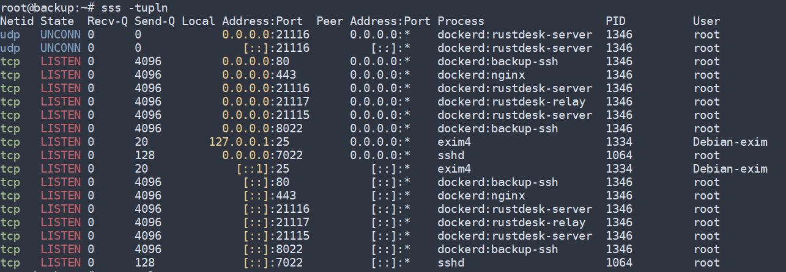

# sss

Colorful IP sockets list (ss command) with docker support

Additionnal feacture:
- auto-sudo
- add docker container name if concerned
- add process PID
- add process User

## Usage

```
Usage: sss [ options ]

Options are the SAME as the standard command `ss`
```

## Install
### APT
Use the repository https://packages.azlux.fr/ and install with `apt update` and `apt install sss`

## Example
### Before
```
root@backup:~# ss -tupln
Netid    State     Recv-Q     Send-Q         Local Address:Port          Peer Address:Port    Process
udp      UNCONN    0          0                    0.0.0.0:21116              0.0.0.0:*        users:(("dockerd",pid=1346,fd=41))
udp      UNCONN    0          0                       [::]:21116                 [::]:*        users:(("dockerd",pid=1346,fd=145))
tcp      LISTEN    0          4096                 0.0.0.0:80                 0.0.0.0:*        users:(("dockerd",pid=1346,fd=28))
tcp      LISTEN    0          4096                 0.0.0.0:443                0.0.0.0:*        users:(("dockerd",pid=1346,fd=31))
tcp      LISTEN    0          4096                 0.0.0.0:21116              0.0.0.0:*        users:(("dockerd",pid=1346,fd=143))
tcp      LISTEN    0          4096                 0.0.0.0:21117              0.0.0.0:*        users:(("dockerd",pid=1346,fd=118))
tcp      LISTEN    0          4096                 0.0.0.0:21115              0.0.0.0:*        users:(("dockerd",pid=1346,fd=21))
tcp      LISTEN    0          4096                 0.0.0.0:8022               0.0.0.0:*        users:(("dockerd",pid=1346,fd=24))
tcp      LISTEN    0          20                 127.0.0.1:25                 0.0.0.0:*        users:(("exim4",pid=1334,fd=5))
tcp      LISTEN    0          128                  0.0.0.0:7022               0.0.0.0:*        users:(("sshd",pid=1064,fd=6))
tcp      LISTEN    0          20                     [::1]:25                    [::]:*        users:(("exim4",pid=1334,fd=6))
tcp      LISTEN    0          4096                    [::]:80                    [::]:*        users:(("dockerd",pid=1346,fd=29))
tcp      LISTEN    0          4096                    [::]:443                   [::]:*        users:(("dockerd",pid=1346,fd=32))
tcp      LISTEN    0          4096                    [::]:21116                 [::]:*        users:(("dockerd",pid=1346,fd=144))
tcp      LISTEN    0          4096                    [::]:21117                 [::]:*        users:(("dockerd",pid=1346,fd=120))
tcp      LISTEN    0          4096                    [::]:21115                 [::]:*        users:(("dockerd",pid=1346,fd=22))
tcp      LISTEN    0          4096                    [::]:8022                  [::]:*        users:(("dockerd",pid=1346,fd=96))
tcp      LISTEN    0          128                     [::]:7022                  [::]:*        users:(("sshd",pid=1064,fd=7))
```

### After

